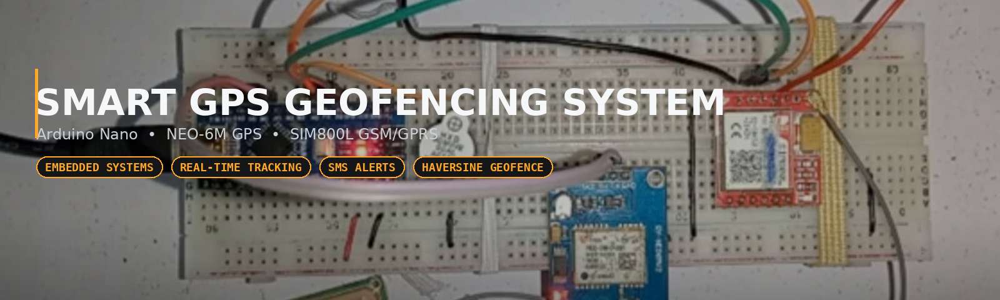
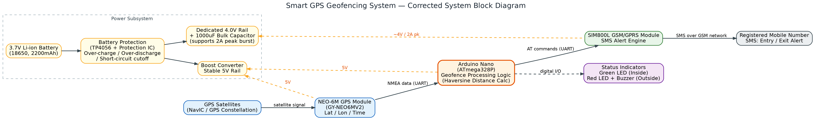
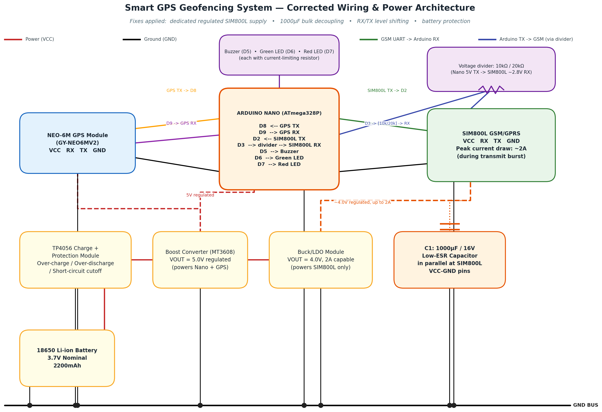
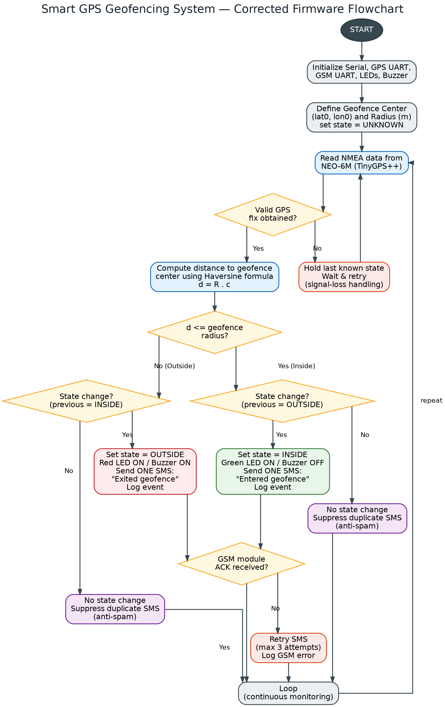
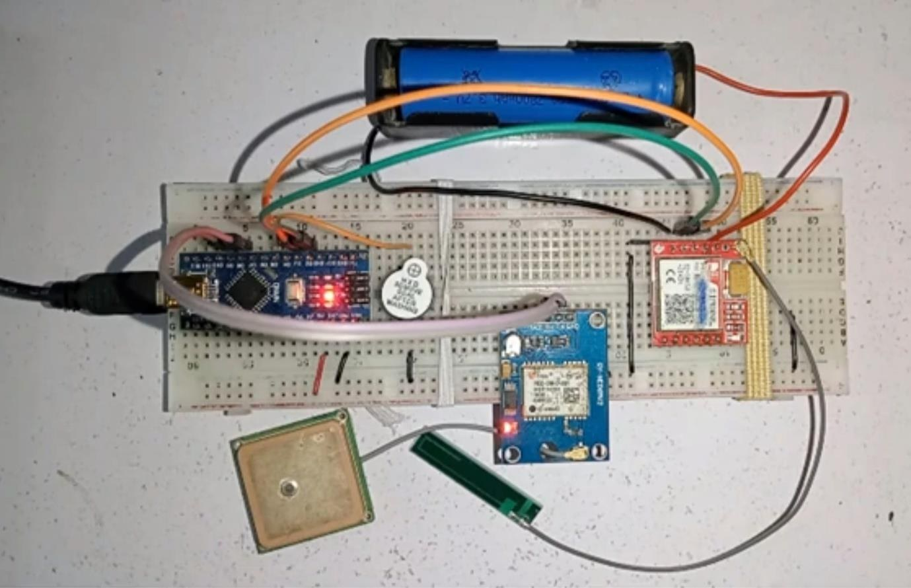
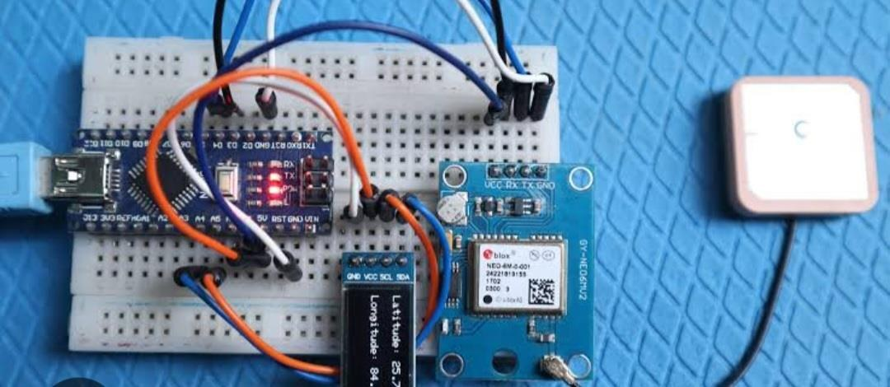
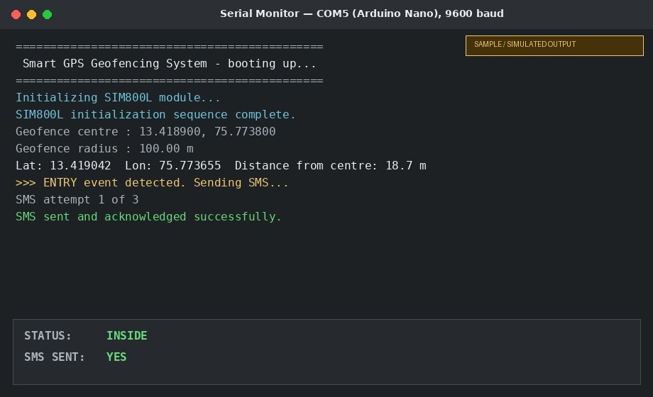
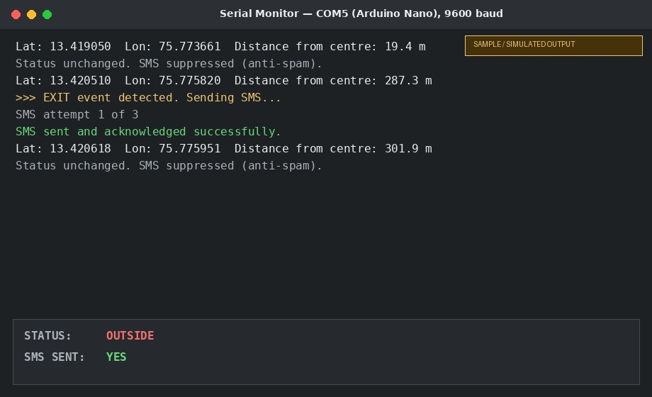

<div align="center">



# Smart GPS Geofencing System

### Real-time Entry/Exit SMS Alerts using Arduino Nano, NEO-6M GPS & SIM800L GSM/GPRS

[](LICENSE)


</div>

---

## Table of Contents

1. [Project Overview](#project-overview)
2. [Problem Statement](#problem-statement)
3. [Features](#features)
4. [Hardware Components](#hardware-components)
5. [Software Stack](#software-stack)
6. [System Architecture](#system-architecture)
7. [Block Diagram](#block-diagram)
8. [Circuit Diagram](#circuit-diagram)
9. [Flowchart](#flowchart)
10. [Pin Connections](#pin-connections)
11. [Working Principle](#working-principle)
12. [Project Images](#project-images)
13. [Output Screenshots](#output-screenshots)
14. [Installation Steps](#installation-steps)
15. [How to Upload the Code](#how-to-upload-the-code)
16. [Testing Procedure](#testing-procedure)
17. [Results](#results)
18. [Advantages](#advantages)
19. [Applications](#applications)
20. [Future Scope](#future-scope)
21. [Repository Structure](#repository-structure)
22. [References](#references)
23. [License](#license)
24. [Author](#author)

---

## Project Overview

A **Smart GPS Geofencing System** draws a virtual boundary (a *geofence*)
around a real-world location and automatically triggers an action the
instant a tracked device enters or exits it. This build pairs an
**Arduino Nano** with a **NEO-6M GPS** module and a **SIM800L GSM/GPRS**
module to deliver a fully standalone hardware tracker: it computes its
live distance from a configured geofence centre using the **Haversine
great-circle formula**, and sends exactly **one SMS alert per genuine
boundary crossing** — no smartphone app, no server, and no internet
dependency on the tracked side.

This repository started from a college Embedded Systems mini-project
report and has been substantially corrected and extended — see
[Critical Fixes](#circuit-diagram) below and
[`hardware/Connection_Details.md`](hardware/Connection_Details.md) for the
full engineering rationale.

> **Scope note:** the original report's literature survey also touches on
> app/cloud-connected geofencing platforms. This repository documents and
> implements only the **standalone embedded hardware system that was
> actually built** (Arduino + GPS + GSM, SMS-based). See
> [`docs/Architecture.md`](docs/Architecture.md) for details.

## Problem Statement

As reliance on real-time location-based services grows across fleet
management, personal safety, security, and retail, traditional tracking
approaches fall short in several ways:

- **Lack of real-time monitoring** — conventional methods are often too
  slow to flag route deviations, unauthorized access, or unsafe movement
  as they happen.
- **Security and safety gaps** — continuously monitoring sensitive areas
  or vulnerable individuals (children, the elderly) is difficult without
  automated, always-on tracking.
- **Costly, connectivity-dependent alternatives** — biometric hardware and
  app/cloud-based LBS platforms require recurring infrastructure and
  internet access that doesn't scale to low-budget or rural deployments.
- **No offline-capable alerting** — most geofencing solutions assume a
  smartphone app with internet access, which is unavailable wherever only
  basic 2G GSM coverage reaches.

This project addresses these gaps with a self-contained hardware tracker
that computes its own geofence logic on-device and alerts entirely over
SMS, requiring nothing more than 2G cellular signal.

## Features

- 📍 **Real-time GPS tracking** via NEO-6M, parsed with TinyGPS++
- 📐 **Accurate geofencing** using the Haversine distance formula (not a flat-Earth approximation)
- 📲 **Automated SMS alerts** on entry and exit, sent via SIM800L
- 🚫 **Anti-spam logic** — exactly one SMS per genuine state transition, never per loop cycle
- 🔋 **Corrected power architecture** — dedicated regulated rail + bulk capacitor for the SIM800L's current bursts
- 🛡️ **Battery protection** via TP4056 (over-charge / over-discharge / short-circuit cutoff)
- 💡 **Local indication** — green/red LEDs and a buzzer for instant on-device feedback
- 🧯 **Graceful failure handling** — GPS signal-loss handling and bounded GSM-send retries

## Hardware Components

| Component | Role |
|---|---|
| Arduino Nano (ATmega328P) | Main microcontroller — geofence logic |
| NEO-6M GPS (GY-NEO6MV2) | Live latitude/longitude acquisition |
| SIM800L GSM/GPRS | SMS alert dispatch over the 2G cellular network |
| 18650 Li-ion Battery (3.7V, 2200mAh) | Portable power source |
| TP4056 Charge + Protection Module | Charging and battery protection |
| Boost converter (→5.0V) | Regulated rail for Arduino + GPS |
| Buck/LDO module (→~4.0V, 2A) | **Dedicated** rail for SIM800L |
| 1000µF/16V capacitor | Bulk decoupling at SIM800L VCC–GND |
| Buzzer, Green LED, Red LED | Local audible/visual indication |

Full bill of materials with approximate costs: [`hardware/BOM.md`](hardware/BOM.md)

## Software Stack

| Layer | Tool/Library |
|---|---|
| Firmware language | C++ (Arduino framework) |
| IDE | Arduino IDE |
| GPS parsing | [TinyGPS++](http://arduiniana.org/libraries/tinygpsplus/) by Mikal Hart |
| Dual serial ports | `SoftwareSerial` (bundled with Arduino IDE) |
| GSM control | AT command set (SIM800L) |

Details: [`software/Libraries.md`](software/Libraries.md) ·
[`software/Configuration_Guide.md`](software/Configuration_Guide.md)

## System Architecture

```text
GPS Satellites → NEO-6M GPS Module → Arduino Nano → SIM800L GSM/GPRS → SMS → Registered Mobile Number
                                          ↑
                              Haversine geofence logic
                                          ↑
                        Battery → Protection → Dual regulated rails
                                  (5V logic  /  ~4V·2A for SIM800L)
```

Full write-up: [`docs/Architecture.md`](docs/Architecture.md)

## Block Diagram



*Corrected from the original report — adds the explicit power subsystem
(battery → protection → dual regulated rails) and labels the Arduino's role
as the geofence processing stage.*

## Circuit Diagram



### Critical fixes applied vs. the original report

| # | Issue in original report | Fix applied here |
|---|---|---|
| 1 | SIM800L implied to share the Arduino's 5V rail | Dedicated buck/LDO rail regulated to **~4.0V**, sized for the module's **~2A peak burst current** |
| 2 | No bulk capacitance at the GSM module | **1000µF/16V low-ESR capacitor** wired directly across SIM800L VCC–GND |
| 3 | No level-shifting between 5V Arduino and 3V-logic SIM800L | **10kΩ/20kΩ voltage divider** on the Arduino TX → SIM800L RX line |
| 4 | No battery protection | **TP4056 module** adds over-charge / over-discharge / short-circuit cutoff |
| 5 | SIM800L mis-labelled as a "Bluetooth module" in one section | Corrected throughout — SIM800L is a **GSM/GPRS** module; it has no Bluetooth capability |

Full rationale and pin-level tables: [`hardware/Connection_Details.md`](hardware/Connection_Details.md)

## Flowchart



The flowchart adds what the original report's diagram left undefined: the
actual **Haversine distance comparison**, a **state-change/anti-spam
check** before sending any SMS, **GPS signal-loss handling**, and a
**GSM ACK + bounded retry** path. See
[`docs/Working_Principle.md`](docs/Working_Principle.md) for the full
step-by-step explanation.

## Pin Connections

| Arduino Nano Pin | Module | Pin | Purpose |
|---|---|---|---|
| D8 | NEO-6M GPS | TX | Receive NMEA data |
| D9 | NEO-6M GPS | RX | (optional) GPS config commands |
| D2 | SIM800L | TX | Receive AT command responses |
| D3 | SIM800L (via 10k/20kΩ divider) | RX | Send AT commands / SMS body |
| D5 | Buzzer | + | Outside-geofence alert |
| D6 | Green LED | anode | Inside-geofence indicator |
| D7 | Red LED | anode | Outside-geofence indicator |
| GND | Common ground bus | — | **Star ground** — required for all modules |

Power-rail connection table (battery → protection → regulators → modules):
[`hardware/Connection_Details.md`](hardware/Connection_Details.md#2-pin-connection-table--power-lines)

## Working Principle

1. NEO-6M continuously streams live NMEA GPS data over UART.
2. Arduino parses it with **TinyGPS++** to get latitude/longitude and fix validity.
3. The firmware computes the great-circle distance to the configured
   geofence centre using the **Haversine formula**.
4. State is classified as **INSIDE** (distance ≤ radius) or **OUTSIDE**.
5. An SMS is sent **only when the state changes** from the last alerted
   state — this is the anti-spam logic that prevents SMS flooding.
6. **SIM800L** sends the SMS via AT commands, with bounded retries on
   failure; LEDs/buzzer give immediate local feedback.
7. If the GPS signal is lost, the system holds its last known state and
   logs a warning rather than guessing.

Full explanation: [`docs/Working_Principle.md`](docs/Working_Principle.md)

## Project Images

<table>
<tr>
<td width="50%"><br><sub>Completed hardware build — Arduino Nano + NEO-6M + SIM800L on breadboard</sub></td>
<td width="50%"><br><sub>GPS module bring-up and satellite acquisition test</sub></td>
</tr>
</table>

A short build-progress slideshow (real photos) is at
[`images/demo.gif`](images/demo.gif).

## Output Screenshots

<table>
<tr>
<td width="50%"><br><sub>Sample Serial Monitor output — inside geofence</sub></td>
<td width="50%"><br><sub>Sample Serial Monitor output — outside geofence</sub></td>
</tr>
</table>

```text
GPS Lock Output
Lat: 13.419042   Lon: 75.773655

Inside Geofence
Status: INSIDE         SMS Sent: YES   ("Entered geofence")

Outside Geofence
Status: OUTSIDE        SMS Sent: YES   ("Exited geofence")
```

> ⚠️ **These screenshots are illustrative mock-ups** of the expected log
> format, generated for documentation purposes — not captured from a
> verified field test. Replace them with your own Serial Monitor
> screenshots from real hardware before citing this section as evidence of
> working hardware (e.g., in an academic submission or portfolio). See
> [`results/output_analysis.md`](results/output_analysis.md).

## Installation Steps

1. **Assemble the hardware** per [`hardware/Circuit_Diagram.png`](hardware/Circuit_Diagram.png)
   and [`hardware/Connection_Details.md`](hardware/Connection_Details.md).
2. **Install the Arduino IDE** from [arduino.cc](https://www.arduino.cc/en/software).
3. **Install required libraries** — see [`software/Libraries.md`](software/Libraries.md):
   - `TinyGPSPlus` (via Library Manager)
   - `SoftwareSerial` (bundled)
4. **Insert an active 2G-capable SIM card** into the SIM800L module.
5. **Open** [`software/Smart_GPS_Geofencing.ino`](software/Smart_GPS_Geofencing.ino)
   in the Arduino IDE.
6. **Configure** the geofence centre, radius, and alert phone number — see
   [`software/Configuration_Guide.md`](software/Configuration_Guide.md).

## How to Upload the Code

1. Connect the Arduino Nano to your computer via USB.
2. In the Arduino IDE, select **Tools → Board → Arduino Nano**.
3. Select the correct **Processor** (old/new bootloader) and **Port**.
4. Click **Upload**.
5. Open **Tools → Serial Monitor** at **9600 baud** to view live GPS
   coordinates, distance-from-centre readings, and SMS status logs.

Full walkthrough: [`software/Configuration_Guide.md`](software/Configuration_Guide.md)

## Testing Procedure

1. Bench-test indoors near a window with a large geofence radius (e.g.,
   500 m) to confirm Serial output format and SMS delivery.
2. Move outdoors with a clear sky view and re-test with the intended
   production radius.
3. Physically cross the boundary in both directions to confirm entry and
   exit SMS alerts each fire exactly once.
4. Leave the device stationary for 10–15 minutes to confirm no repeated
   ("spam") SMS is sent.

Full test case table: [`results/test_cases.md`](results/test_cases.md)

## Results

- Distance is computed with the **Haversine great-circle formula**,
  scaling correctly even for larger geofence radii (unlike a flat
  lat/lon-degree approximation).
- SMS volume is bounded to **one message per boundary crossing**.
- GPS signal loss and GSM send failures are logged and handled gracefully
  rather than causing silent failures or false alerts.

Full analysis (with the sample-output disclaimer): [`results/output_analysis.md`](results/output_analysis.md)

## Advantages

- Works with only **2G GSM signal** — no internet/app dependency on the tracked side
- **Spam-free** SMS alerting protects SIM balance and the recipient's inbox
- **Zero server round-trip latency** — geofence logic runs entirely on-device
- **Low-cost, portable**, battery-powered, breadboard-friendly build
- **Protected power design** prevents brown-outs during SMS transmission

## Applications

| Use case | Description |
|---|---|
| Home Automation | Detect proximity to home for automation triggers |
| Workplace Attendance | Auto-log entry/exit at the office geofence |
| Delivery Notifications | Alert customers when a delivery vehicle is near |
| Parental Controls | Alert parents if a child leaves a safe zone |
| Fleet & Asset Management | Detect warehouse/depot boundary crossings |
| Elderly / Personal Safety | Alert caregivers on unexpected departure from a safe zone |
| Restricted-Area Security | Alert on unauthorized perimeter breach |

Full write-up: [`docs/Applications.md`](docs/Applications.md)

## Future Scope

- Support for **multiple simultaneous geofences**
- Optional **cloud logging/dashboard** over GPRS for fleet-scale use
- **Hysteresis band** near the boundary to reduce GPS-accuracy-driven jitter
- **Solar-assisted charging** for extended unattended deployment
- Migration to **ESP32** for native Wi-Fi/BLE and app-based configuration

## Repository Structure

```text
Smart-GPS-Geofencing-System/
├── README.md
├── LICENSE
├── .gitignore
├── docs/
│   ├── Project_Report.pdf          # original mini-project report
│   ├── Architecture.md
│   ├── Working_Principle.md
│   ├── Literature_Survey.md
│   └── Applications.md
├── hardware/
│   ├── Block_Diagram.png
│   ├── Circuit_Diagram.png
│   ├── Flowchart.png
│   ├── Connection_Details.md
│   └── BOM.md
├── software/
│   ├── Smart_GPS_Geofencing.ino
│   ├── Libraries.md
│   └── Configuration_Guide.md
├── images/
│   ├── banner.png, project_setup.jpg, gps_satellite_connection.jpg
│   ├── block_diagram.png, circuit_diagram.png, flowchart.png
│   ├── output_1.jpg, output_2.jpg, demo.gif
├── results/
│   ├── screenshots/
│   ├── test_cases.md
│   └── output_analysis.md
└── presentations/
    ├── Mini_Project_PPT.pptx
    └── Project_Poster.png
```

## References

[1] R. Prasadh, "Geofencing Application using IRNSS/NavIC," *2022 2nd
International Conference on Intelligent Technologies (CONIT)*, 2022.

[2] R. Shinde, "Design and Development of Geofencing Based Attendance
System for Mobile Application," *2022 10th International Conference on
Emerging Trends in Engineering and Technology – Signal and Information
Processing (ICETET-SIP-22)*, 2022.

[3] K. S. Yamuna, "Human Safety Using GPS and Geofencing," *2024 4th
International Conference on Sustainable Expert Systems (ICSES)*, 2024.

Full survey with context: [`docs/Literature_Survey.md`](docs/Literature_Survey.md)

## License

This project is licensed under the [MIT License](LICENSE).

## Author

**Pavan Shetty H S**
Electronics & Communication Engineering student

---

<div align="center">
<sub>⭐ If this repository helped you, consider starring it.</sub>
</div>
